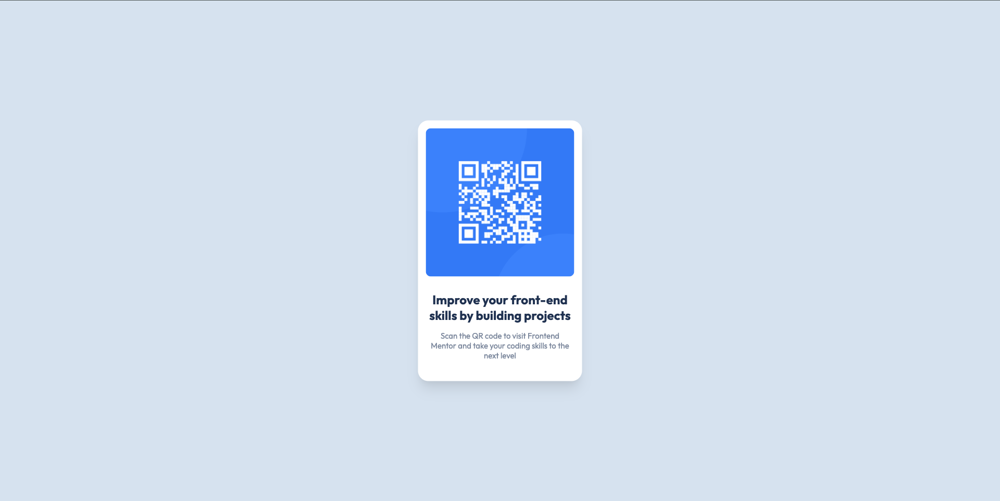

# Frontend Mentor - QR code component solution

This is a solution to the [QR code component challenge on Frontend Mentor](https://www.frontendmentor.io/challenges/qr-code-component-iux_sIO_H). Frontend Mentor challenges help you improve your coding skills by building realistic projects.

## Table of contents

- [Overview](#overview)
  - [Screenshot](#screenshot)
  - [Links](#links)
- [My process](#my-process)
  - [Built with](#built-with)
  - [What I learned](#what-i-learned)
  - [Continued development](#continued-development)
  - [Useful resources](#useful-resources)
- [Author](#author)

## Overview

### Screenshot

### Links

- Solution URL: [https://github.com/amsandiego/qr-code-component-main](https://github.com/amsandiego/qr-code-component-main)
- Live Site URL: [https://amsandiego.github.io/qr-code-component-main](https://amsandiego.github.io/qr-code-component-main)

## My process

### Built with

- HTML5
- CSS3
- Flexbox

### What I learned

- How to use GitHub CLI to push an existing local repo to GitHub
- How to center a div
- How to center text and images
- How to use custom Google fonts

### Continued development

- Responsiveness

### Useful resources

- [Different ways to center a div in a webpage](https://dev.to/abthakur/different-ways-to-center-a-div-in-a-webpage-5enn) - I learned the different ways I could center a div. Ultimately, for the container div in this project, I used absolute positioning.

## Author

- GitHub - [amsandiego](https://github.com/amsandiego)
- Frontend Mentor - [@amsandiego](https://www.frontendmentor.io/profile/amsandiego)
